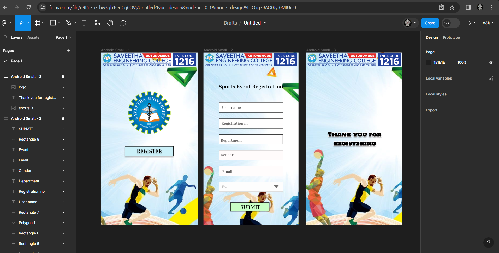

# Ex09 Event Registration Web Application
# Name : P.Bharathraj
# Ref  : 212223230031

## AIM:
To design, develop and deploy a web application for event registration.

## DESIGN STEPS:

### Step 1:
Create a new frame.

### Step 2:
Select any one preset size of your choice.

### Step 3:
Select the shapes you need.

### Step 4:
Import images as needed.

### Step 5:
Create pages based on your need and link them.

### Step 6:

Validate the HTML and CSS code.

### Step 6:

Publish the website in the given URL.

## DESIGN TOOL:
Figma

## CODE:
```
PAGE 1

<div style="width: 100%; height: 100%; position: relative; background: white">
    
    <div style="width: 181px; height: 37px; left: 89px; top: 348px; position: absolute; background: #CCF1F9; box-shadow: 0px 4px 4px rgba(0, 0, 0, 0.25); border: 1px black solid"></div>
    <div style="width: 162px; height: 23px; left: 99px; top: 354px; position: absolute; text-align: center; color: black; font-size: 20px; font-family: Inria Serif; font-weight: 700; word-wrap: break-word">REGISTER</div>
    
    
</div>

// REGISTER
color: black;
 font-size: 20px;
 font-family: Inria Serif;
 font-weight: 700;
 word-wrap: break-word

 PAGE 2

 <div style="width: 100%; height: 100%; position: relative; background: white">
    
    
    <div style="width: 239px; left: 57px; top: 113px; position: absolute; text-align: center; color: black; font-size: 20px; font-family: Inria Serif; font-weight: 700; word-wrap: break-word">Sports Event Registration</div>
    <div style="width: 239px; height: 39px; left: 57px; top: 184px; position: absolute; background: #FFFFFF; border: 1px black solid"></div>
    <div style="width: 238px; height: 37px; left: 58px; top: 245px; position: absolute; background: #FFFEFE; border: 1px black solid"></div>
    <div style="width: 238px; height: 37px; left: 57px; top: 304px; position: absolute; background: #FFFEFE; border: 1px black solid"></div>
    <div style="width: 238px; height: 37px; left: 58px; top: 363px; position: absolute; background: #FFFBFB; border: 1px black solid"></div>
    <div style="width: 238px; height: 37px; left: 58px; top: 481px; position: absolute; background: #FDFDFD; border: 1px black solid"></div>
    <div style="width: 238px; height: 37px; left: 58px; top: 422px; position: absolute; background: #FFFCFC; border: 1px black solid"></div>
    <div style="width: 134px; height: 22px; left: 69px; top: 193px; position: absolute; color: #5D5C5C; font-size: 14px; font-family: Inria Serif; font-weight: 700; word-wrap: break-word">User name</div>
    <div style="width: 122px; height: 23px; left: 67px; top: 251px; position: absolute; color: #6E6C6C; font-size: 14px; font-family: Inria Serif; font-weight: 700; word-wrap: break-word">Registration no</div>
    <div style="width: 112px; height: 12px; left: 64px; top: 320px; position: absolute; color: #6A6666; font-size: 14px; font-family: Inria Serif; font-weight: 700; word-wrap: break-word">Department</div>
    <div style="width: 112px; height: 20px; left: 64px; top: 370px; position: absolute; color: #6C6868; font-size: 14px; font-family: Inria Serif; font-weight: 700; word-wrap: break-word">Gender</div>
    <div style="width: 119px; height: 19px; left: 70px; top: 432px; position: absolute; color: #595858; font-size: 14px; font-family: Inria Serif; font-weight: 700; word-wrap: break-word">Email</div>
    <div style="width: 96px; height: 21px; left: 69px; top: 488px; position: absolute; color: #7E7C7C; font-size: 14px; font-family: Inria Serif; font-weight: 700; word-wrap: break-word">Event</div>
    <div style="width: 145px; height: 33px; left: 100px; top: 557px; position: absolute; background: #C9FFC5; border: 1px black solid"></div>
    <div style="width: 120px; height: 17px; left: 114px; top: 565px; position: absolute; text-align: center; color: black; font-size: 20px; font-family: Inria Serif; font-weight: 700; word-wrap: break-word">SUBMIT</div>
</div>

// Sports Event Registration
color: black;
 font-size: 20px;
 font-family: Inria Serif;
 font-weight: 700;
 word-wrap: break-word
---
// User name
color: #5D5C5C;
 font-size: 14px;
 font-family: Inria Serif;
 font-weight: 700;
 word-wrap: break-word
---
// Registration no
color: #6E6C6C;
 font-size: 14px;
 font-family: Inria Serif;
 font-weight: 700;
 word-wrap: break-word
---
// Department
color: #6A6666;
 font-size: 14px;
 font-family: Inria Serif;
 font-weight: 700;
 word-wrap: break-word
---
// Gender
color: #6C6868;
 font-size: 14px;
 font-family: Inria Serif;
 font-weight: 700;
 word-wrap: break-word
---
// Email
color: #595858;
 font-size: 14px;
 font-family: Inria Serif;
 font-weight: 700;
 word-wrap: break-word
---
// Event
color: #7E7C7C;
 font-size: 14px;
 font-family: Inria Serif;
 font-weight: 700;
 word-wrap: break-word
---
// SUBMIT
color: black;
 font-size: 20px;
 font-family: Inria Serif;
 font-weight: 700;
 word-wrap: break-word

 PAGE 3

 <div style="width: 100%; height: 100%; position: relative; background: white">
    
    <div style="width: 255px; height: 278px; left: 52px; top: 182px; position: absolute; text-align: center; color: black; font-size: 20px; font-family: Holtwood One SC; font-weight: 400; word-wrap: break-word">Thank you for registering</div>
    
</div>

// Thank you for registering
 color: black;
 font-size: 20px;
 font-family: Holtwood One SC;
 font-weight: 400;
 word-wrap: break-word
```
## OUTPUT:


## RESULT:
The program to design, develop and deploy a web application for event registration is completed successfully.
